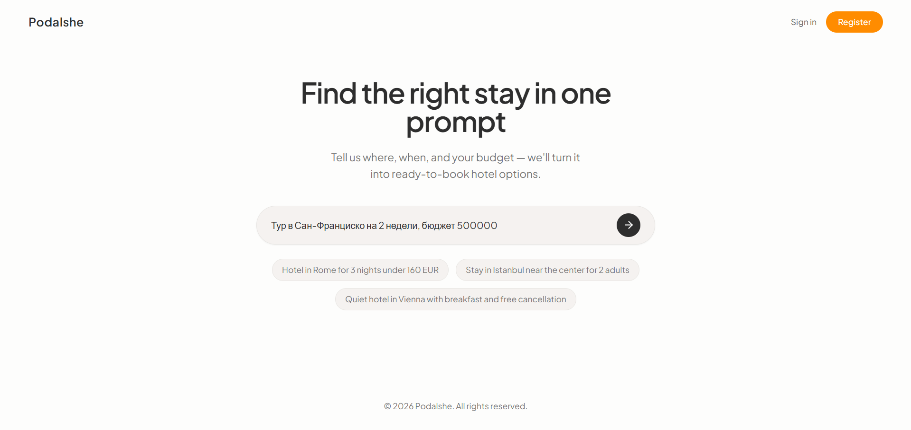
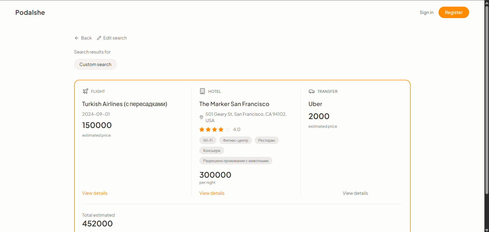

# HSE Project

Full-stack web application with React frontend, Node.js backend, PostgreSQL database, and email confirmation.

## Setup

1. Clone the repository.
2. Copy `.env` and fill in GEMINI_API_KEY, RAPID_API_KEY, DATABASE_URL, DB_NAME, DB_USER, DB_PASSWORD.
3. Run `docker-compose up --build` to start the application.

Frontend will be at http://localhost:5173
Backend at http://localhost:8000

## Features

- User registration with email confirmation
- PostgreSQL database
- Docker deployment

## Screenshots

Примеры интерфейса:

## Footage

Футаж в /assets/footage.mp4